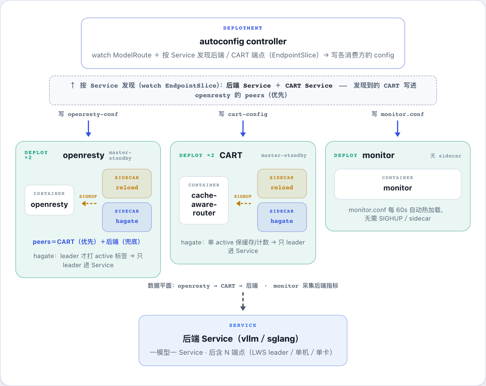

# autoconfig

从 k8s 按 **Service 自动发现后端端点**（watch 其 EndpointSlice；一个 Service = 一个「模型」桶），渲染并实时更新
**openresty**、**cache-aware-router（CART）**、可选 **monitor** 的 peer/worker/监控配置 —— 免去手工维护路由器的后端列表。
上 k8s 后 Service 背后的端点（pod IP）随扩缩容/重启变化，autoconfig 让这几处配置跟着自动收敛。

输入是 **`ModelRoute` CRD**（一个模型一条），`kubectl apply` 当场校验、`kubectl get mr` 直接看发现了几个后端。
（早期 ConfigMap 驱动的「agent 模式」已移除。）

## 工作原理



三个独立二进制 / 镜像，各司其职：

| 组件 | 镜像 | 角色 |
|---|---|---|
| **controller** | `autoconfig`（`cmd/`） | 唯一发现逻辑 + RBAC 一处；watch ModelRoute + EndpointSlice → 发现 → 渲染 → 写 ConfigMap + status。controller 自身 `replicas>1` 时靠 manager 的 leader 选举保证只有一个在干活。 |
| **reload sidecar** | `autoconfig-reload`（`cmd/reload`） | 跑在消费方 pod 里，watch 挂载的 ConfigMap 文件，变化就 `kill -HUP` 主进程（靠 `shareProcessNamespace`）。CART / openresty 收 SIGHUP 优雅重载。 |
| **hagate sidecar** | `autoconfig-hagate`（`cmd/hagate`） | 消费方 **master-standby**：2 副本都保持 Ready，但只有持 Lease 的 leader 给自己 pod 打 `<name>-active=true` 标签；Service selector 带这个标签 → **只有 leader 进 endpoints**。用标签而非 readiness 门控，standby 不会永久 NotReady 卡住滚动。 |

**master-standby（hagate）细节**：leader 选举用 Lease `<name>-ha`；计划内下线（SIGTERM）主动释放 Lease + 摘标签
→ standby ~1-2s 接管；硬崩则等 Lease 过期接管。标签协调是 **level-triggered**——每 2s 读 pod 实际标签与「该不该 active
（是 leader 且本地 app 端口可连）」比对，不符就纠正，**标签被外部弄掉也能自愈**。openresty/cart 默认开
（`replicas: 2` + `ha.enabled: true`）；monitor 默认关（`replicas: 1`，采集/告警是自主循环，不靠 Service 门控）。

## 输入：ModelRoute CRD

`ModelRoute`（`routing.gpucluster.io/v1alpha1`），一个模型一个对象。字段说明见样例
[`config/samples/modelroute-glm.yaml`](config/samples/modelroute-glm.yaml)。一条 ModelRoute 可同时驱动：

- **CART 的 workers**（写 cart-config，专属 → ownerRef 级联 GC）；`cart` 段可选，省略 = openresty 直连后端。
- **openresty 的 peers**（写 openresty-conf，多路由共享一个 ConfigMap → 用 finalizer 摘各自 key）。
- **monitor 的三类行**（`spec.monitor`，可选；每模型一个 key）：
  - `service: <name> | <url> | <model> | <gpu_type>` —— 发现的后端（每实例一行）；
  - `nginx: <svc>-<i> | http://ip:port` —— 探测 openresty 入口 pod（`spec.monitor.nginx` 的 service/selector；跨模型自动 dedup）；
  - `router: <name>-router-<i> | http://ip:port/workers` —— 复用已探测的 CART pod（有 `spec.cart` 时默认开，`spec.monitor.router: false` 关）。
  - monitor 自身每 60s 热加载 monitor.conf、**无需 reload sidecar**（区别于 openresty/CART）；消费方把该 ConfigMap 挂进 monitor pod 即可。

## 消费方接入

autoconfig 只负责把配置**写进已有的 ConfigMap**（不创建 chart、不创建 ConfigMap）；消费方把对应 ConfigMap 挂进自己的 pod。
三套 chart 在 `deploy/helm/{openresty,cart,monitor}/`（各自建初始 ConfigMap + reload/hagate sidecar + Service 门控）。

**openresty 侧**：ConfigMap 整卷挂会覆盖整个目录，而 `.conf` 和 `lua/` 同在 `conf.d/`。所以把
**session_route*.conf 移到子目录 `conf.d/routes/`**，ConfigMap 只挂到那里；`lua/` + `router_locations.inc` + `nginx.conf`
仍烤镜像。`nginx.conf` 把 `include conf.d/*.conf;` 改成 `include conf.d/routes/*.conf;`（lua_package_path 不变）。

**reload sidecar**：消费方 pod 加一个容器，镜像 `autoconfig-reload`，+ `shareProcessNamespace: true` + 把输出 ConfigMap
**整卷挂**（非 subPath——subPath 不随 ConfigMap 更新）：
```yaml
args: ["--watch","/watch","--process","nginx: master"]   # 或 "cache-aware-router"
```

## 用法

**Helm 部署 controller（推荐）** —— chart 在 `deploy/helm/autoconfig/`（含 CRD + SA/RBAC + Deployment）：
```bash
helm upgrade --install autoconfig deploy/helm/autoconfig -n autoconfig --create-namespace
kubectl apply -f config/samples/modelroute-glm.yaml
kubectl get mr -A                                   # NAME/BACKENDS/CART/READY/AGE
```
常用 values：`image.tag`、`replicas`（>1 leader 选举 HA）、`leaderElection`、`modelRoutes`（直接在 chart 里声明路由）。
CRD 放在 chart 的 `crds/`（Helm install-once、`helm uninstall` **不删**，保护已有 ModelRoute；升级 CRD schema 用
`make install` 或 `kubectl apply -f config/crd/bases/...`）。

裸 manifest（不用 helm 时）：
```bash
kubectl apply -f config/crd/bases/routing.gpucluster.io_modelroutes.yaml     # 装 CRD
kubectl apply -f deploy/controller.yaml                                       # 起 controller
```

**⚠️ 卸载顺序：先删 ModelRoute，再 `helm uninstall`。** ModelRoute 带 finalizer（`routing.gpucluster.io/cleanup`），
要 controller 在跑才能摘。若先 uninstall（删了 controller）再删 ModelRoute / namespace，ModelRoute 会卡住、拖住
namespace/CRD 删除。正确：`kubectl delete mr --all -A` → `helm uninstall`。（chart 里用 `modelRoutes` 声明的 ModelRoute
由 helm 托管，uninstall 前会随 release 删除、controller 还在 → 自动摘 finalizer，无此问题。）已卡住的补救：
`kubectl patch mr <n> -n <ns> --type=merge -p '{"metadata":{"finalizers":[]}}'`。

## 构建（三个镜像）

多阶段 build，依赖已 vendor（`vendor/` 入库），全程离线——不联网、不预置二进制：
```bash
docker build              -t harbor.4pd.io/hardcore-tech/autoconfig:<tag>        .   # controller(cmd/)
docker build -f Dockerfile.reload -t harbor.4pd.io/hardcore-tech/autoconfig-reload:<tag> .   # reload sidecar
docker build -f Dockerfile.hagate -t harbor.4pd.io/hardcore-tech/autoconfig-hagate:<tag> .   # hagate sidecar
```

**CI（`.gitlab-ci.yml`）：打 git tag 自动 build+push 三个镜像**（各 `:<tag>` + `:latest`；`public-buildx` runner，
docker 已 login harbor）。该 runner 只 go1.17.6 且够不到外网，故用 vendor 离线 + golang builder 从 harbor 拉。
改依赖后 `go mod vendor` 重新入库。本地快速验证：`GOOS=linux GOARCH=amd64 CGO_ENABLED=0 go build -mod=vendor ./cmd/...`。

## 验证状态（别混淆两层）

- **CRD controller**（现版）：k8s-cpu-20 + **mock 后端**已验——发现分桶、**写出的 cart-config/openresty-conf/monitor-conf
  内容正确**、status、scale 跟随、fail-safe、删除清理（finalizer/ownerRef）、`make install`/`make deploy`。即验到「autoconfig
  写对 ConfigMap」为止。
- **真 openresty + 真 CART + 真 monitor 端到端接入**（经 helm chart，真 reload/serve、master-standby failover）：见
  `test/e2e/real_helm_e2e.sh`、`ha_failover_check.sh`；真后端（kimi LWS / vllm）见 `real_kimi_e2e.sh` / `verify_v12_vllm.sh`。

## 开发布局（kubebuilder / operator-sdk v4）

标准 operator 布局：`PROJECT` + `Makefile` + `api/v1alpha1`（带 kubebuilder marker 的类型）+ `internal/controller`（reconciler）
+ `internal/{discovery,sink,hagate,reload}` + `config/`（kustomize：crd/rbac/manager/default/samples）。

- **改了 `api/` 类型或 `+kubebuilder:` marker 后**，跑生成、提交生成物（CI 不跑生成，只编译）：
  ```bash
  make generate manifests    # controller-gen 生成 deepcopy + config/crd/bases + config/rbac/role.yaml,并同步 CRD 到 helm/crds
  make test                  # 生成 + fmt + vet + go test
  ```
  工具用 `go run ...@version`（见 Makefile），不装二进制、不进 vendor/CI。
- **部署两条路都可**：生产用 **Helm**（`deploy/helm/autoconfig`）；kustomize 用 `make deploy`（`config/default`）。
  两者的 CRD/RBAC 同源（都来自 `config/` 的生成物）。

## 注意（踩坑）

- **ConfigMap 必须整卷挂**（非 subPath）才会随更新自动同步；kubelet 同步有 **~1min 延迟**——对 peer 更新可接受
  （health-timer + proxy_next_upstream 兜过渡），对 CART 反而是天然去抖（reload 会重建 radix tree）。
- **fail-safe**：发现结果为空绝不写空（CART 拒绝空 workers；openresty 会丢全部流量）。
- **reload 找 pid 只比 argv[0]**（不是整条 cmdline，也不用 comm——comm 截断 15 字符）：否则 sidecar 自己的
  `--process nginx: master` 参数会自匹配。规则：argv[0] 相等 / basename 相等 / 以 match 开头（nginx master 的
  argv[0] = `nginx: master process ...`）。
- **env 名别撞 k8s Service 注入**：若有名为 `cart` 的 Service，k8s 会注入 `CART_PORT=tcp://...`；autoconfig 的 env 前缀统一 `PS_`。
