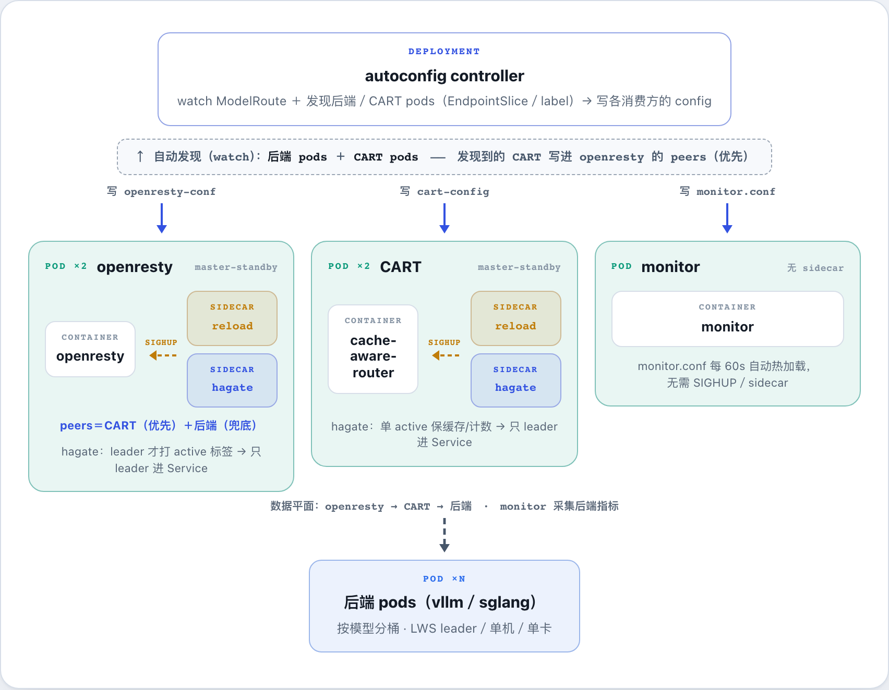

# autoconfig

English | [简体中文](README.zh-CN.md)

**A Kubernetes operator that keeps the routing layer's backend lists in step with what is actually running.**

When you serve inference on Kubernetes, backend pod IPs change all the time: scaling, restarts, rolling
updates. The routing components in front of them — openresty, the cache-aware router (CART), monitoring —
each keep their own list of peers / workers / scrape targets. Syncing those lists by hand is tedious and
easy to get wrong: a scale-up that never reaches the list is wasted, and a scale-down that is never removed
keeps sending traffic to a dead IP.

autoconfig describes "what routing for one model looks like" with a `ModelRoute` custom resource, and then:

1. **Discovers** — watches the EndpointSlices of the model's Service (or a pod label selector) to get the
   backend endpoints that are ready right now;
2. **Renders** — generates the openresty route config, the CART worker list and the monitoring targets;
3. **Delivers** — writes them into ConfigMaps the consumers already have, where each consumer's sidecar
   hot-reloads them.

```bash
kubectl apply -f config/samples/modelroute-glm.yaml
kubectl get mr -A      # NAME  BACKENDS  CART  READY  AGE
```

When backends scale, nobody has to do anything: the `BACKENDS` column changes on its own.

## What it does not do

- **It creates no charts and no ConfigMaps** — it only writes content into ConfigMaps the consumers
  **already have**. Deploying a consumer, its initial config and its sidecar mounts is that consumer's
  chart's job (see "Integrating consumers").
- **It does not proxy traffic** — it is a control plane; openresty and CART remain the data plane.
- **It applies no LLM health semantics to other workloads** — `modelType: video` is rendered as a plain
  reverse proxy, without the token-level rate limiting.

## Quick start

```bash
# 1. Deploy the controller (the chart contains the CRD, RBAC and the Deployment)
helm upgrade --install autoconfig deploy/helm/autoconfig -n llm-route --create-namespace

# 2. Declare a route
kubectl apply -f config/samples/modelroute-glm.yaml

# 3. Look at what was discovered
kubectl get mr -A
kubectl describe mr <name>     # status has backends / cartPeers / conditions
```

The chart is also published as `modelsphere/autoconfig` in the
[modelsphere Helm repository](https://github.com/modelsphere/helm-charts); installing the whole stack
(autoconfig, CART, openresty, a test model) is described in [DEPLOY.md](DEPLOY.md).

Without Helm, use kustomize (same generated manifests): `make install` (CRD) + `make deploy` (controller).

**⚠️ Uninstall order: delete the ModelRoutes first, then `helm uninstall`.** A ModelRoute carries a
finalizer (`routing.modelsphere.dev/cleanup`) that only a running controller can remove. If you uninstall
first (removing the controller) and then delete ModelRoutes or their namespace, the ModelRoutes hang and
block the deletion of the namespace and the CRD. The right order: `kubectl delete mr --all -A` →
`helm uninstall`. (ModelRoutes declared through the chart's `modelRoutes` value are managed by Helm: they are
deleted with the release while the controller is still running, so the finalizer is removed and this does
not happen.) To free ModelRoutes that are already stuck:
`kubectl patch mr <n> -n <ns> --type=merge -p '{"metadata":{"finalizers":[]}}'`.

## How it works



Three separate binaries / images, each with one job:

| Component | Image | Role |
|---|---|---|
| **controller** | `autoconfig` (`cmd/`) | The only discovery logic and the only place with RBAC. Watches ModelRoute + EndpointSlice + Pod → discovers → renders → writes ConfigMaps + status. With `replicas>1`, the manager's leader election makes sure only one replica does the work. |
| **reload sidecar** | `autoconfig-reload` (`cmd/reload`) | Runs in the consumer's pod, watches the mounted ConfigMap files and `kill -HUP`s the main process when they change (needs `shareProcessNamespace`). CART and openresty reload gracefully on SIGHUP. |
| **hagate sidecar** | `autoconfig-hagate` (`cmd/hagate`) | Consumer **master-standby**: both replicas stay Ready, but only the leader holding the Lease labels its own pod `<name>-active=true`; the Service selects on that label → **only the leader is in the endpoints**. Gating with a label instead of readiness means the standby is never permanently NotReady and never stalls a rollout. |

The three images share one version number with each other and with the chart (`appVersion` = image tag);
see "Building".

## How the two sidecars work

Besides the main container, each consumer pod (openresty / CART) carries two autoconfig sidecars:
**hagate** (master-standby gate) and **reload** (config hot reload). Both work alongside the main container
through `shareProcessNamespace: true`.

### hagate — single-active master-standby gate

**Why single-active**: openresty and CART are **stateful** routers (openresty keeps session affinity and an
`active_conns` concurrency count; CART keeps a prefix-cache radix tree). With several replicas in the
Service endpoints at once, the cache is scattered and the concurrency count split, and routing quality
drops. So they run **two replicas as master-standby**: both running, only one taking traffic at a time.

**Why not gate with a readinessProbe**: if the standby were kept NotReady to keep traffic away, a Deployment
rollout would count that permanently NotReady standby as unavailable under `maxUnavailable`/`minReady` and
stall. Hence a **label gate** instead of readiness.

**Mechanism**: one hagate sidecar per pod takes part in leader election on the Lease `<name>-ha`.
- Only the leader holding the Lease labels **its own pod** `<name>-active=true`;
- The Service's selector includes that label → **only the leader's pod is in the endpoints**; the standby
  waits outside the pool;
- Consumers upstream (for example openresty's cart tier) go through the **Service ClusterIP VIP**, which
  always points at the active leader → failover and rollouts are transparent to them.

**Level-triggered self-healing**: every 2s it reads the pod's actual label, compares it with whether the pod
**should be active** (= it is the leader **and** the local app port accepts connections), and corrects any
difference — so a label removed by someone else heals itself, and a leader whose local app port is unreachable
removes its own label rather than send traffic to a broken pod.

**Failover**: on a planned shutdown (SIGTERM: pod deletion, rollout, eviction) it releases the Lease → the
standby takes over **new** traffic in about 1–2s. The old pod **keeps** its active label and stays a
**terminating endpoint** (deletionTimestamp set); the CNI's graceful-termination handling sends new
connections to the standby while in-flight connections drain on the old pod (together with the main
container's graceful stop and grace period). **The label is not torn off, so in-flight connections are not
reset**; the pod leaves the endpoints when it exits. Only when leadership is lost while the pod is alive
(Lease renewal fails) does it remove the label and leave the Service, to avoid two active pods. After a hard
crash, the standby takes over when the Lease TTL expires.

**The monitoring component has no HA**: scraping and alerting are a **self-driven polling loop** (it takes no
external traffic), so a readiness gate cannot stop duplicate scraping and single-active buys nothing → it
runs as a singleton (`replicas: 1` + `Recreate`), and its chart has no hagate.
openresty and CART enable it by default (`replicas: 2` + `ha.enabled: true`).

### reload — config hot reload

**Problem**: once autoconfig rewrites a ConfigMap, the main process (nginx / CART) must re-read its config,
but must not restart (that would cut long in-flight streaming connections).

**Mechanism**: one reload sidecar per consumer pod:
- The output ConfigMap is **mounted as a whole volume** (not with subPath — a subPath mount does not follow
  ConfigMap updates) at the `--watch` directory and watched with fsnotify;
- When a file changes → find the main process's pid (read `/proc/*/cmdline` and match `nginx: master` /
  `cache-aware-router`; **cmdline rather than `comm`**, since comm is truncated to 15 characters, and nginx
  workers must not match) → `kill -HUP`;
- **SIGHUP is a graceful reload for both nginx and CART**: a bad config only logs a warning and keeps the old
  one, and in-flight requests are never interrupted.

**Propagation delay**: the kubelet syncs mounted ConfigMaps with a delay of about a minute (the AtomicWriter
swaps the `..data` symlink atomically, so reload always sees complete files, never a half-written one).

**`--sock-dir` for openresty**: per-model servers listen on unix sockets, and nginx does not unlink a model's
leftover `.sock` after the model is deleted; before reloading, the sidecar deletes orphan sockets that no conf
references any more.

## The ModelRoute CRD

`ModelRoute` (`routing.modelsphere.dev/v1alpha1`), one object per model. `kubectl apply` validates it on the
spot with CEL, and `kubectl get mr` shows what was discovered. A full example is
[`config/samples/modelroute-glm.yaml`](config/samples/modelroute-glm.yaml). The tables below describe each
field (✅ = required).

**Top-level `spec`**

| Field | Required | Meaning |
|---|---|---|
| `modelType` | optional | What kind of model this route serves; decides how it is rendered. Default `llm`; `video` = video generation, see below |
| `discovery` | ✅ | How this model's backend bucket is discovered (feeds CART workers / nginx backends / monitor services) |
| `cart` | optional | Set = autoconfig manages this CART; omitted = nginx talks to the backends directly (no CART tier) |
| `nginx` | ✅ | openresty routing: peers rendered → `session_route_<route>.conf` |
| `monitor` | optional | Also write the discovered backends / entry point / CART into the shared monitoring config |

### modelType: what kind of model a route serves

| Value | Rendered as | For |
|---|---|---|
| `llm` (default) | The Lua routing engine: session affinity, TTFT/TPS limits, adaptive concurrency, CART in front | Token-streaming APIs such as `/v1/chat/completions` |
| `video` | **A plain reverse proxy**: no request-body parsing, no rate limiting; long timeouts, response buffering off, `Range` passed through, `X-Forwarded-Host/Proto` filled in | Video generation: asynchronous job creation + polling + large file downloads |

Why video cannot reuse the LLM setup: a request body can be a 64 MB base64 image (the engine would parse the
body to find the model); one clip takes 1–3 minutes (token-level metrics such as TTFT/TPS mean nothing);
the response is a video stream of tens of MB (response buffering would hold it in memory or on disk); and
downloads must support resuming (`Range` has to pass through untouched).

The tuning keys available for `video` are listed below (CEL rejects any other key, so nothing gets configured
in the belief that it has an effect):

| `nginx.values` key | Default | Meaning |
|---|---|---|
| `max_body_size` | `64m` | Request body limit (I2V allows base64 images) |
| `proxy_timeout` | `3600s` | Read/write timeout (generation + large downloads) |
| `connect_timeout` | `10s` | Timeout for connecting to the backend |
| `rate_limit` | **unset = no limit** | **Per-connection** download rate limit; `limit_rate` is rendered only when set. Accepts `200Mbps`/`1.5Gbps` (bits, converted to the bytes/second nginx wants) or nginx's own notation (`25m`/`512k`) |
| `rate_limit_after` | `1m` (only when `rate_limit` is set) | The first N bytes go at full speed. Creating, querying and deleting jobs are a few hundred bytes of JSON and should not be slowed by the download limit |
| `upload_conn_limit` | unset = no limit | Concurrent connections per IP (`limit_conn`); excess requests get 503 |
| `upload_req_limit` | unset = no limit | Request rate per IP (`limit_req`, nginx notation such as `10r/s`) |
| `upload_req_burst` | unset = no burst | Burst allowance for `upload_req_limit` |
| `api_keys` | unset = **no authentication** | Comma-separated Bearer tokens, the same convention as LLM routes; a mismatch returns 401 |
| `auth_public_paths` | `~^/v2/video_generation/[^/]+/content$` | Paths exempt from authentication (left side of an nginx map). Downloads are exempt by default: `content.url` is handed to end users, browsers send no Authorization header, and the job id is a UUID, effectively a one-time capability URL. Empty = downloads need a key too |
| `upload_limit_key` | `$http_x_real_ip` | What the two zones above are keyed by. **`$binary_remote_addr` does not work**; see the end of this document |

**A download rate limit needs buffering on**: with `proxy_buffering off`, nginx ignores `limit_rate`
entirely (measured on 50 MB: static file 4.99s / buffering on 4.61s / buffering off 0.089s; `proxy_limit_rate`
behaves the same). So when `rate_limit` is set, the template renders `proxy_buffering on` +
`proxy_max_temp_file_size 0` — buffering without temporary files, so a full buffer applies backpressure
upstream. Without a rate limit it stays `proxy_buffering off`, streaming as it receives.

**There is no byte-level limit on uploads**: `limit_rate`/`proxy_limit_rate` only apply to responses, and
nginx has no directive that limits how fast a request body is read (doing it would mean reading
`ngx.req.socket` in Lua with sleeps, losing the backpressure `proxy_request_buffering` already provides). So
uploads are bounded by three gates: `max_body_size` caps the size of one request, `upload_conn_limit` caps
concurrency, and `upload_req_limit` caps frequency — one source's inbound bandwidth ≈ concurrency × per-request
rate.

A rate limit limits **speed, not size** — `client_max_body_size` applies to the request body, not the
response, and `proxy_buffering off` keeps responses out of temporary files, so downloaded videos can be any size
(1 GB at 200 Mbps takes about 40 seconds). `proxy_read_timeout` limits the gap between two reads, not the total
duration.

CEL also rejects `video` combined with `cart` / `slo` / `monitor`: the first two are LLM-specific; the
monitor's liveness checks and alerts are designed for LLM endpoints and would only raise false alarms against
a video service (scrape the service's own metrics with Prometheus instead).

Under `video`, peer priorities map to nginx's two tiers, primary and `backup`: the highest-priority group is
primary, and lower ones (such as the `backend-svc` VIP fallback) are marked `backup` and only take over when the
whole pod-IP tier is down.

**Delivery is exactly the same as for `llm`**: written to the `session_route_<route>.conf` key of
`nginx.outputConfigMap`, picked up by the reload sidecar watching the mounted directory → `SIGHUP`. There is no
second channel. (The sidecar also uses the conf's `listen unix:.../<route>.sock;` line to tell which sockets are
still in use; the video template keeps the same listen line format, and a test guards it.)

Example: [`config/samples/modelroute-minimax-h3.yaml`](config/samples/modelroute-minimax-h3.yaml).

**`spec.discovery`** — how one bucket of backends is discovered

| Field | Type | Default / constraint | Meaning |
|---|---|---|---|
| `service` | string | **exactly one of** `service` / `selector` | EndpointSlice discovery (recommended); `ns/name` works across namespaces (a bare name means the ModelRoute's namespace) → ModelRoutes can live in a central namespace |
| `selector` | string | **exactly one of** `service` / `selector` | Pod label discovery (fallback for single-node / single-GPU backends without a Service) |
| `port` | int | optional, derived when omitted | Backend port; taken from the EndpointSlice for `service`, from the containerPort for `selector` (only a single port can be derived) |
| `includeNotReady` | bool | `false` | By default only Ready endpoints are used (draining endpoints are excluded); `true` = include not-ready ones |

**`spec.cart`** — omit the whole block for no CART

| Field | Type | Default / constraint | Meaning |
|---|---|---|---|
| `service` / `selector` | string | **exactly one** | How the CART pods are discovered (for openresty's cart source); `service` accepts `ns/name` |
| `port` | int | derived when omitted | CART port (derived from a single EndpointSlice port / containerPort) |
| `outputConfigMap` | string | ✅ | `ns/name` of the ConfigMap CART's `config.yaml` is written to; the base config (server/cache/health) is created in it by the CART chart's `values.baseConfig`, and autoconfig only rewrites the `workers` section |
| `outputKey` | string | `config.yaml` | Which key of that ConfigMap the workers go to. Point it at a workers-only key (for example `workers.yaml`) to leave the base config key entirely to the chart; CART merges `-c config.yaml -c workers.yaml` in that order |
| `maxLoad` | int | `20` | `max_load` per worker |

**`spec.nginx`** — openresty routing

| Field | Type | Default / constraint | Meaning |
|---|---|---|---|
| `route` | string | omitted = `metadata.name` | Short route name = conf file name + openresty dict name + `<route>.sock` + external path key `/<route>/`. **Characters must be within `[a-z0-9._-]`** (it is captured by the dispatch path regex; with upper case no socket is derived and port 8080 cannot reach it) |
| `peers` | list | ✅ (≥1) | Ordered peer groups (see the `peers[]` table) |
| `outputConfigMap` | string | ✅ | Output ConfigMap `ns/name` (shared by many routes, one key per route; the finalizer removes each route's own key) |
| `values` | map | optional | Any tuning keys, rendered as-is into the table returned by Lua `register_route` (key=value) → a new tuning key needs no code change |
| `service` | string | optional | The nginx entry point's own Service `ns/name` → used for the monitor's `nginx:` lines and to react to entry pods scaling; the port is the Service's named dispatch port 8080 |
| `selector` | string | optional | nginx entry pods by label (fallback without a Service; alternative to `service`, which wins if both are set) |

**`spec.nginx.values` example — dynamic rate limiting (adaptive concurrency, AIMD)**

Setting `tps_limit_tps` opts the route in; unless `adaptive_cc: "false"` is set explicitly, `adaptive_cc`
follows the global default and turns on. Removing `values` returns to no rate limiting.

```yaml
spec:
  nginx:
    route: qwen
    service: llm-route/openresty
    outputConfigMap: llm-route/openresty-conf
    values:                       # any key, rendered as-is into the Lua register_route opts (values must be strings)
      tps_limit_tps: "30"         # decode-rate floor (tok/s): EWMA below it → AIMD lowers concurrency, above it → raises (= the opt-in switch)
      # adaptive_cc_min: "10"     # optional: concurrency floor (unset = static max × global min_frac)
      # ttft_limit_ms: "60000"    # optional: soft TTFT threshold
      # adaptive_cc: "false"      # optional: turn adaptive concurrency off and use the static hard limit
    peers:
    - { use: cart, priority: 3, maxConcurrencyFromBackend: true }
    - { use: backend, priority: 2, maxConcurrency: 100 }
    - { use: backend-svc, priority: 1 }
```

Once applied, `GET /<route>/_tps_status` on openresty should show `opt_in=true, adaptive_cc_on=true`.

**`spec.nginx.peers[]`** — ordered tiers (higher number = preferred; traffic falls through to a lower tier
only when every peer of the higher tier is banned)

| Field | Type | Default / constraint | Meaning |
|---|---|---|---|
| `use` | enum | ✅ `cart`\|`backend`\|`backend-svc` | See "The three `use` values" below |
| `priority` | int | — | openresty peer priority (suggested: cart=3, backend=2, backend-svc=1) |
| `maxConcurrency` | int | omitted = `values.default_max` | Concurrency limit for every peer in the group |
| `maxConcurrencyFromBackend` | bool | only meaningful for `use:cart` | `true` = the cart limit is dynamic = per-backend concurrency × number of backends (CART fans out to N backends, so capacity follows scaling); overrides a static `maxConcurrency`, and **requires `maxConcurrency>0` on the `backend` group** as the multiplier |
| `probePath` | string | see right when omitted | Overrides openresty's health probe path (GET; a status line containing 200 = healthy, otherwise banned). `use:cart` defaults to `/health` (CART's `/v1/models` is cached and returns 200 even when every worker is down, so it is no signal); other tiers default to empty = the route's `health_probe_path` |

The three `use` values:
- **`cart`** (priority 3) — the CART upstream, through the **CART Service's ClusterIP (VIP, not pod IPs)**: CART
  runs master-standby and the VIP always points at the active leader → CART failover and rollouts are
  transparent to openresty, and autoconfig need not rewrite anything.
- **`backend`** (priority 2) — backend **pod IPs** (the main tier for session affinity / least_conn /
  per-peer health).
- **`backend-svc`** (priority 1, optional fallback) — the backend **Service's ClusterIP (VIP) as a static
  fallback**: if **autoconfig itself is down while the backend rolls out**, the pod-IP tier holds dead IPs and
  nobody rewrites it → without a fallback everything fails. The VIP is maintained by kube-proxy and does not
  depend on autoconfig; when the whole pod-IP tier is banned, traffic falls through to it → **degraded (through
  kube-proxy, no affinity) but not down**. Needs `discovery.service` (selector mode has no VIP and skips it).

**`spec.monitor`** — optional. The monitoring component reloads itself every 60s, **with no reload sidecar**
(unlike nginx/CART). One key per model, three kinds of lines:

| Field | Type | Default / constraint | Meaning |
|---|---|---|---|
| `outputConfigMap` | string | ✅ | ConfigMap `ns/name` the monitoring config is written to (shared by many models, one key per model) |
| `model` | string | omitted = `metadata.name` | The model field of the `service:` lines (served-model-name) |
| `gpuType` | string | derived when omitted | The gpu_type of the `service:` lines; omitted = a short name derived from the backend node's GPU label `nvidia.com/gpu.product` (GFD), left empty if it cannot be derived |
| `nginx` | bool | default `true` (when `spec.nginx` has a service/selector) | Reuse the nginx entry discovery to write `nginx:` lines; `false` turns it off |
| `router` | bool | default `true` (when `spec.cart` is set) | Reuse the CART pods discovered for `spec.cart` to write the `router:` lines (`.../workers`); `false` turns it off |

The three output line formats: `service: <name> \| <url> \| <model> \| <gpu_type>` (one line per backend
instance), `nginx: <svc>-<i> \| http://ip:8080/<route>`, `router: <name>-router-<i> \| http://ip:port/workers`.

**CEL validation (errors at apply time)**: ① for `discovery`/`cart`, **exactly one** of `service` and
`selector`; ② if `nginx.peers` uses `cart`, `spec.cart` must be set; ③ if `cart` uses
`maxConcurrencyFromBackend`, the `backend` group must have `maxConcurrency>0`.

## Integrating consumers

autoconfig only **writes config into existing ConfigMaps** (it creates no charts and no ConfigMaps). Each
consumer's chart creates the initial ConfigMap, the reload/hagate sidecars and the Service gate, and mounts the
ConfigMap into its pod. The `autoconfig-reload` / `autoconfig-hagate` sidecar images are built from this
repository and referenced by the consumers. The three consumers:

| Consumer | ConfigMap autoconfig writes → mounted file | reload sidecar |
|---|---|---|
| **openresty** | `openresty-conf` → `conf.d/routes/session_route_<route>.conf` | ✅ `--process "nginx: master"` + `--sock-dir` |
| **cart** (cache-aware-router) | `cart-config` → `configs/config.yaml` (only the `workers` section is rewritten) | ✅ `--process cache-aware-router` |
| **monitoring** | `monitor-conf` → `conf.d/<model>.monitor.conf` | ❌ reloads itself every 60s |

### openresty

- **ConfigMap delivery (why a subdirectory)**: mounting a ConfigMap as a whole volume replaces the whole
  directory, and the `.conf` files and `lua/` both live in `conf.d/`. So the `session_route*.conf` files moved to
  the subdirectory **`conf.d/routes/`**, and the ConfigMap (`openresty-conf`) is mounted only there; `lua/` +
  `router_locations.inc` + `nginx.conf` + the **8080 dispatch (`session_base.conf`)** stay baked into the image.
  The include in `nginx.conf` changes from `conf.d/*.conf` to `conf.d/routes/*.conf` (`lua_package_path` is
  unchanged).
- **Path routing (a single external port)**:
  - The image bakes in a dispatch server on `listen 8080` that, by the first path segment `/<route>/`, forwards
    at runtime to the unix socket of the per-model server (`<prefix>/sock/<route>.sock`) — one external port, no
    mapping table.
  - Per-model servers only `listen unix:.../<route>.sock` (no TCP port), so `spec.nginx.route` = external path
    key = socket name; the `session_route_<route>.conf` autoconfig generates contains exactly this socket listen.
  - The dispatch server passes the real client IP of requests to 8080 in `X-Real-IP`, and the per-model
    `set_real_ip_from unix:` restores `$remote_addr` → tuning endpoints restricted with `allow 127.0.0.1` stay
    reachable only from inside the pod.
- **reload sidecar**: `--process "nginx: master"` + **`--sock-dir`**.

### cart

- **ConfigMap delivery**: `cart-config` is mounted as a whole volume → cart starts with `-c configs/config.yaml`.
  The base config (`server`/`cache`/`health`) is created in this ConfigMap by the CART chart's
  `values.baseConfig`; autoconfig only rewrites the `workers` section.
- **reload sidecar**: `--process cache-aware-router`.

### Monitoring

- **ConfigMap delivery**: `monitor-conf` is mounted as a whole volume → `conf.d/<model>.monitor.conf` (shared by
  many models, one key per model).
- **No reload sidecar**: it reloads itself every 60s and needs no SIGHUP (unlike openresty/cart).

### Adding the reload sidecar (openresty / cart)

See "reload — config hot reload" above for how it works. To add it, give the consumer pod an
`autoconfig-reload` container (`shareProcessNamespace: true` is needed to send SIGHUP, and the output
ConfigMap must be **mounted as a whole volume** at `--watch`), with args:

```yaml
# openresty
args: ["--watch","/watch","--process","nginx: master","--sock-dir","/usr/local/openresty/nginx/sock"]
# cart
args: ["--watch","/watch","--process","cache-aware-router"]
```

## Building (three images)

Multi-stage builds: a Go builder compiles, and the binary is copied into a runtime base image. **Nothing is
vendored**; the committed `go.sum` keeps builds reproducible with `GOSUMDB=off`, and `GOTOOLCHAIN=local` stops
Go from downloading a toolchain.

The base images and the Go module proxy are `ARG`s that **default to public sources**, so a fresh clone builds
as is:

```bash
docker build                        -t autoconfig:dev        .   # controller (cmd/)
docker build -f Dockerfile.reload   -t autoconfig-reload:dev .   # reload sidecar
docker build -f Dockerfile.hagate   -t autoconfig-hagate:dev .   # hagate sidecar
```

| ARG | Default | Description |
|---|---|---|
| `GO_BASE` | `golang:1.23.3-alpine3.20` | Base image of the build stage |
| `RUNTIME_BASE` | `python:3.12-alpine` | Runtime base image |
| `GOPROXY` | `https://proxy.golang.org,direct` | Go module proxy |

On an internal or restricted network, point them at mirrors:

```bash
docker build \
  --build-arg GO_BASE=<registry>/library/golang:1.23.3-alpine3.20 \
  --build-arg RUNTIME_BASE=<registry>/<project>/python:3.12-alpine \
  --build-arg GOPROXY=<your-goproxy> \
  -t autoconfig:dev .
```

`make docker-build` passes no overrides by default; pass them through `BUILD_ARGS`, for example
`make docker-build BUILD_ARGS="--build-arg GOPROXY=<your-goproxy>,direct"`. On a git tag,
`.github/workflows/release.yml` builds the three images (linux/amd64 + linux/arm64) and pushes them to Docker
Hub (`4pdosc/`). The chart is published from
[modelsphere/helm-charts](https://github.com/modelsphere/helm-charts); leave `image.tag` in `values.yaml` empty
so it falls back to the chart's `appVersion` — **do not pin a version in values**.

Quick local check: `go build ./cmd/...`.

## Testing

```bash
make test        # code generation + fmt + vet + go test ./...
```

`test/e2e/` holds end-to-end scripts that need a working Kubernetes cluster (`kubectl` + `helm`). They cover
the CRD controller's discovery bucketing / rendered content / status / following scale changes / fail-safe /
finalizer cleanup, and real openresty + real CART integrated through Helm charts (real reload, path routing over
unix sockets, `openresty -t` validation, master-standby failover). Defaults can be overridden with environment
variables; secrets such as the auth key must be provided explicitly (the scripts stop with an error if they are
unset — there is no default).

## Development layout (kubebuilder / operator-sdk v4)

The standard operator layout: `PROJECT` + `Makefile` + `api/v1alpha1` (types with kubebuilder markers)
+ `internal/controller` (the reconciler) + `internal/{discovery,sink,hagate,reload}`
+ `config/` (kustomize: crd/rbac/manager/default/samples).

**After changing a type in `api/` or a `+kubebuilder:` marker**, run the generators and commit the output (CI
reruns them and fails on any difference):

```bash
make generate manifests    # controller-gen: deepcopy + config/crd/bases + config/rbac/role.yaml, and copies the CRD into the Helm chart
make test                  # generate + fmt + vet + go test
```

Tools run as `go run ...@version` (see the Makefile); no binaries are installed or committed.

**Two ways to deploy**: **Helm** for production (`deploy/helm/autoconfig`), or kustomize with `make deploy`
(`config/default`). Both use the same CRD/RBAC, generated from `config/`.

## Notes and pitfalls

- **ConfigMaps must be mounted as whole volumes** (not subPath) to follow updates, and the kubelet syncs them
  with a **delay of about a minute** — acceptable for peer updates (health timers + `proxy_next_upstream` cover
  the transition), and for CART a natural debounce (a reload rebuilds the radix tree).
- **Fail-safe**: an empty discovery result is never written (CART rejects an empty worker list; openresty would
  drop all traffic).
- **reload matches the pid on argv[0] only** (not the whole cmdline, and not comm, which is truncated to 15
  characters): otherwise the sidecar's own `--process nginx: master` argument would match itself. Rule: argv[0]
  equal / basename equal / starts with the match (the nginx master's argv[0] is `nginx: master process ...`).
- **Keep env names clear of Kubernetes Service injection**: if there is a Service named `cart`, Kubernetes
  injects `CART_PORT=tcp://...`; autoconfig's env prefix is always `PS_`.

### Why the rate-limit key does not default to `$binary_remote_addr`

The production path is dispatch (`:8080` TCP) → `proxy_pass` to a **unix socket** → each route's server block.
The unix-socket hop has no IP; measured at the route level:

```
via dispatch → unix socket:   remote_addr=[unix:]  xff=[127.0.0.1]  xrealip=[127.0.0.1]
client sends XFF:             remote_addr=[unix:]  xff=[203.0.113.7, 127.0.0.1]
direct, for comparison:       remote_addr=[127.0.0.1]
```

`$remote_addr` is always the string `unix:` — every request computes the same key, so `limit_conn 4` becomes
"4 connections for the whole service" instead of "4 per IP". This has nothing to do with whether there is a
gateway in front; it follows from the dispatch → route hop going through a unix socket.
