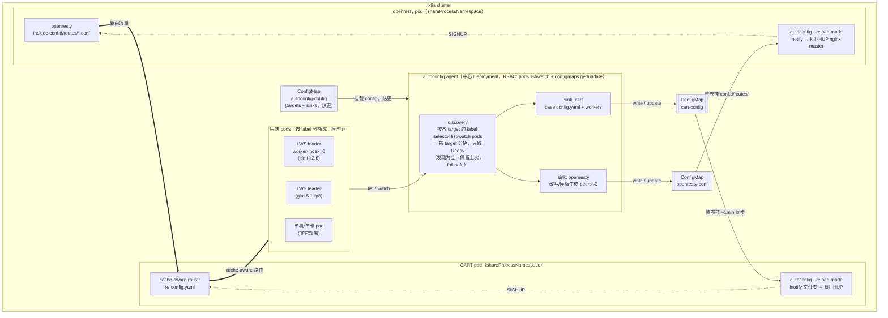

# autoconfig 架构

autoconfig 只做一件事:**把「k8s 里当前在跑哪些后端」实时同步成 openresty / CART 的 peer 配置**,
免去手工维护路由器后端列表。分两个平面看——

- **Config plane(autoconfig 负责,下图实线)**:中心 agent 发现后端 → 渲染 → 写 ConfigMap;
  每个消费方 pod 里一个 reload sidecar,配置变了就 `SIGHUP` 主进程优雅重载。
- **Data plane(流量,下图虚线粗箭头)**:openresty → CART → 后端。autoconfig **不碰流量**,只改配置。

## 关键设计点(图里看不出的)

- **agent 一处发现逻辑 + 一处 RBAC**;reload 是**同一个二进制** `--reload-mode`,靠 `shareProcessNamespace`
  给同 pod 的主进程发 SIGHUP。CART/openresty 收 SIGHUP 都是优雅重载,坏配置只 log warning 保留旧配置。
- **发现用 pod-label,不用 Service/EndpointSlice**:EndpointSlice 绑定在 Service 上、反映的是「某 Service 的后端」;
  而 LWS 默认的整组 headless Service 会把不服务的 worker 也含进来,单机/单卡又未必有对的 Service。
  pod-label 直接选 leader(`worker-index=0`)/ 任意模型 pod,更通用、少前置依赖。
- **target 是中间层**:`后端 label ─selector→ target ─sink 按名引用→ 输出 ConfigMap`。加/改模型 = 改 agent config
  (ConfigMap 热更,免重启 agent)。
- **fail-safe + diff**:发现为空绝不写空(CART 拒空 workers、openresty 会丢全部流量);渲染没变不写 ConfigMap
  → 不触发多余 reload(CART reload 会重建 radix tree = 清 prefix cache,本就不想频繁 reload)。
- **ConfigMap 必须整卷挂**(非 subPath)才随更新自动同步;kubelet ~1min 传播延迟,对 peer 更新可接受
  (health-timer + proxy_next_upstream 兜过渡)。
